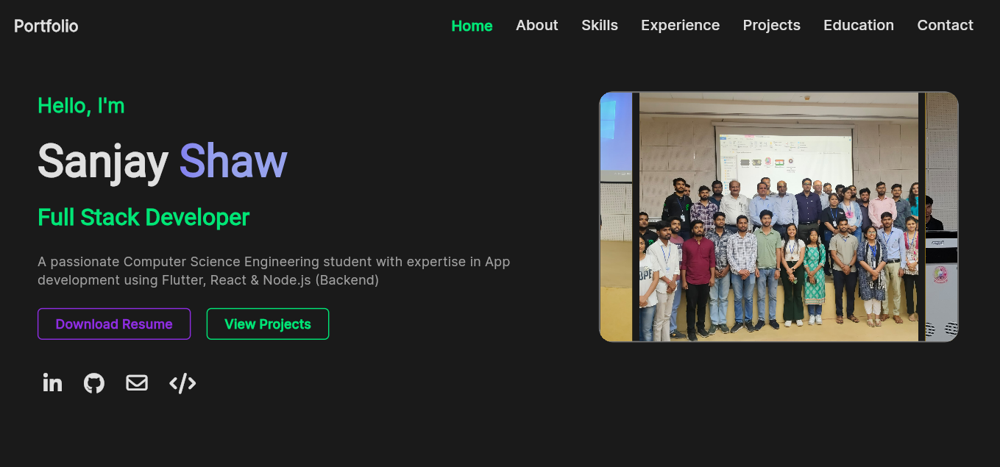

# 🚀 Flutter Developer Portfolio

A modern, responsive portfolio website built with Flutter showcasing my projects, skills, and experience as a Flutter developer.
# Screen Shot


**[🚀 Protfolio Preview ](https://img.shields.io/badge/View-Demo-blue?style=for-the-badge&logo=github)](https://latest-portfolio-sand.vercel.app/#/home)**

## ✨ Features

- 🎨 **Modern UI/UX** - Clean and professional design
- 📱 **Fully Responsive** - Works on all devices (Mobile, Tablet, Desktop)
- ⚡ **Fast Performance** - Optimized for smooth user experience
- 🌙 **Dark/Light Theme** - Theme switching capability
- 🔍 **SEO Friendly** - Optimized for search engines
- 📧 **Contact Form** - Integrated contact functionality
- 🎯 **Smooth Animations** - Engaging user interactions

## 🛠️ Tech Stack

**Frontend:**
- Flutter Web
- Dart
- GetX (State Management)
- Responsive Framework

**Styling:**
- Custom CSS-like styling
- Material Design 3
- Google Fonts

**Tools & Services:**
- GitHub Pages (Deployment)
- VS Code
- Git Version Control

## 🚀 Live Demo

Visit the live portfolio:``` https://latest-portfolio-sanjay-shaws-projects.vercel.app/#/home```

## 📦 Installation

To run this project locally:

1. **Clone the repository**
   ```bash
   git clone https://github.com/FlutterSanjay/Latest_Portfolio.git
   cd Latest_Portfolio
